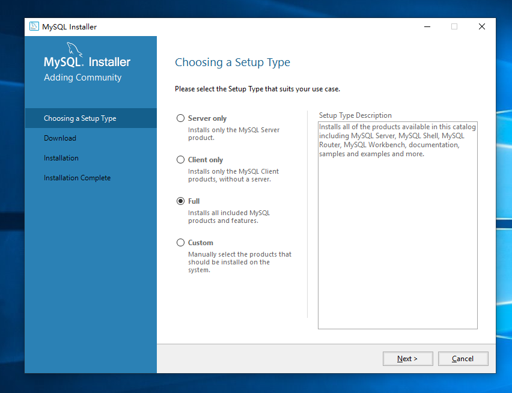
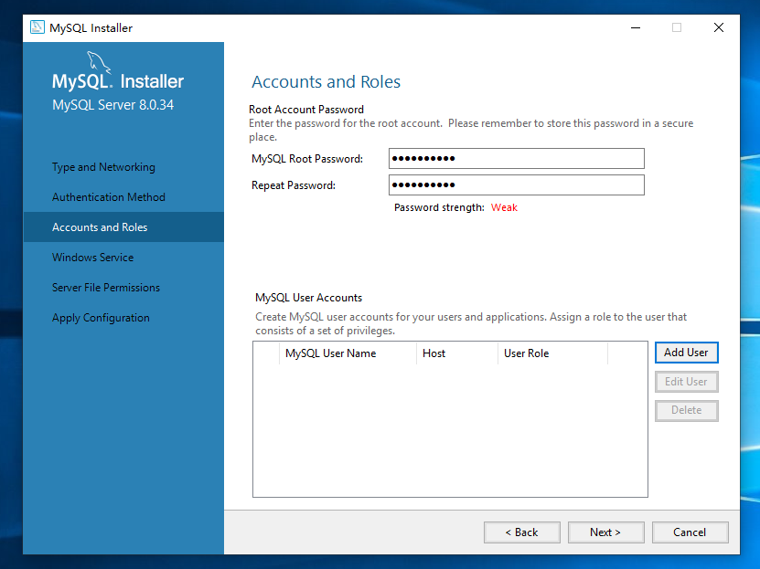
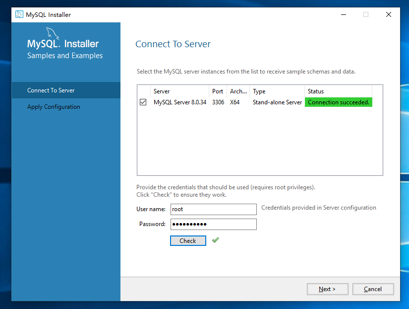

# 系统部署手册

该项目为领航CRM，基于B-S架构。该文档围绕服务端部署，详细展开部署过程。

该文档完成日期为2026.7.19。默认读者会打开控制台和环境变量面板。

## 依赖

### C++

该项目MySQL所用依赖为Microsoft Visual C++ 2019 Redistributable Package (x64)，可在https://learn.microsoft.com/zh-cn/cpp/windows/latest-supported-vc-redist?view=msvc-170获取下载。

定位到下载可执行文件的URL为：

https://aka.ms/vc14/vc_redist.x64.exe

### JDK

该项目部署所用JDK版本为21，可在https://www.oracle.com/java/technologies/javase/jdk21-archive-downloads.html获取下载。

定位到下载JDK可执行文件和msi Installer的URL为：

https://download.oracle.com/java/21/archive/jdk-21.0.10_windows-x64_bin.exe

https://download.oracle.com/java/21/archive/jdk-21.0.10_windows-x64_bin.msi

下载完毕后请安装到路径%PATH1%下。

安装完毕后，请打开环境变量设置页面，在系统变量添加或修改变量JAVA_HOME，值为%PATH1%；在系统变量的Path中添加%PATH1%/bin。

### Tomcat

该项目部署所用Tomcat版本为9，向下兼容Tomcat 7，可在https://tomcat.apache.org/download-90.cgi获取下载。

定位到下载Tomcat压缩包的URL为：

https://dlcdn.apache.org/tomcat/tomcat-9/v9.0.120/bin/apache-tomcat-9.0.120.zip

https://dlcdn.apache.org/tomcat/tomcat-9/v9.0.120/bin/apache-tomcat-9.0.120-windows-x64.zip

下载完毕后请解压到路径%PATH2%下（解压结果装在压缩包同名文件夹里）。

该项目同时支持嵌入式Tomcat 7部署。

### MySQL

该项目部署所用MySQL所用版本为8.0.46，可在https://dev.mysql.com/downloads/installer/获取下载。

定位到下载MySQL msi Installer的URL为：

https://cdn.mysql.com//Downloads/MySQLInstaller/mysql-installer-community-8.0.46.0.msi

以下为安装时选项，其他保持默认（如端口）。请记住root用户密码。

MySQL安装路径不支持中文，请确保安装路径为ASCII字符串。







### Maven

该项目部署所用Maven所用版本为3.9.16，可在https://maven.apache.org/download.cgi获取下载。

定位到下载Maven压缩包的URL为：

https://dlcdn.apache.org/maven/maven-3/3.9.16/binaries/apache-maven-3.9.16-bin.zip

下载完成后请解压到路径%PATH3%下（解压结果装在压缩包同名文件夹里）。

下载完毕后，请打开环境变量设置页面，在系统变量的Path中添加%PATH3%/apache-maven-3.9.16-bin/apache-maven-3.9.16/bin。

## 部署

将该项目放到%PATH4%下。打开MySQL 8.0 Command Line Client - Unicode，输入root用户的密码，输入：

```
source %PATH4%/assignment/crm_db.sql
```

以创建数据库环境。

将该项目下的src/main/resources/jdbc.properties中的password改为MySQL安装时root用户的password。打开控制台，输入：

```
cd /d %PATH4%/assignment
```

注意，不带/d参数的cd命令仅在同一个虚拟磁盘内有效。

切换路径后，输入：

```
mvn clean package
```

将项目打包成war包。可以在target文件夹下发现一个crm-pro.war文件。将其复制到%PATH2%/apache-tomcat-9.0.120/apache-tomcat-9.0.120/webapps下，输入：

```
cd /d %PATH2%/apache-tomcat-9.0.120/apache-tomcat-9.0.120/bin
startup.bat
```

即可开始启动服务端。若使用嵌入式Tomcat 7，输入：

```
cd /d %PATH4%/assignment
mvn tomcat7:run
```

即可开始启动服务端。

## 浏览器端

访问127.0.0.1:8080/crm-pro/login开始使用该服务。

## 关于一键启动

开发者若使用IntelliJ IDEA，导入项目后可在Run/Debug Configurations中配置Tomcat运行，具体方式请参考IntelliJ官方文档。

项目部署时，不应考虑在大型IDE内部署，因为会给服务端计算机带来不必要的负担。